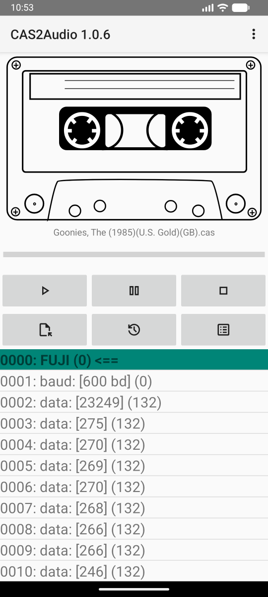

# CAS2Audio

Play back tape images for 8-bit Atari computers on mobile devices with Android.

## Overview

* CAS2Audio plays back Atari 8-bit tape images (.cas) files on small portable devices
(phones, tablets) running Android
* CAS2Audio is a satellite project of TURGEN - <https://turgen.sourceforge.io/>

### Highlights

* Simple, easy to use user interface with easy access to the recently selected tape images
* Support for both standard records (FUJI, baud, data, fsk) and turbo records (pwms, pwmc, pwmd, pwml)
* You can pause the playback and resume from any tape image chunk
* The signal is generated on-the-fly (no temporary wave files are needed)
* Displays animated cassette during playback

## Technical information

### OS Version

At least Android 12.0 (API 31) is required to run the most recent version

### Installation

* Download the .apk package from the "Releases" section
* Open the .apk package. As the .apk package doesn't come from Google Play, it will be reported
  as unknown or insecure. You will need to confirm that you want to install the package anyway.
* If the installation fails, you might need to uninstall the previous version first

### Available settings

* Mono or Stereo output
* 44100 Hz and 48000 Hz sampling rates
* For turbo records, you can choose waveform - sine wave or square wave
* Adjustable signal amplitude

### Permissions

* Read only access to storage
* Wake lock (to prevent the device from sleeping when playing back)

## Screenshot

