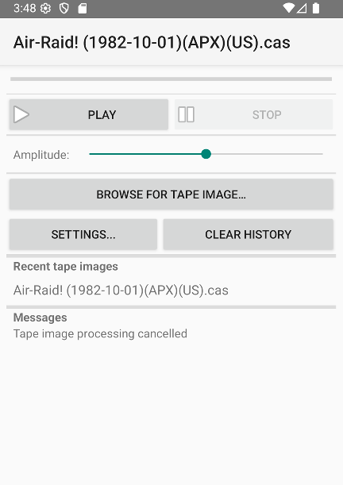

# CAS2Audio
Play back tape images (.cas) for 8-bit Atari computers on mobile devices with Android.

## Overview

* CAS2Audio allows you to play back Atari 8-bit tape images (.cas) files on small portable devices (phones, tablets) running Android. Full description of the tape image format is available at http://a8cas.sourceforge.net/format-cas.html
* CAS2Audio is a satellite project of TURGEN - https://turgen.sourceforge.io/

### Highlights

* The signal is generated on-the-fly (no temporary wave files)
* Standard records (FUJI,baud,data,fsk) are supported
* Turbo records (pwms,pwmc,pwmd,pwml) are supported
* 44100 Hz and 48000 Hz sampling rates
* Mono or Stereo output
* For turbo records, you can choose waveform - sine wave or square wave
* Adjustable amplitude
* Convenient tape image selection

## Installation

* Note that the application is provided as a *loose apk package*. Your device can issue security warnings during the installation.
* Download the .apk package from the "Releases" section
* Ensure that the application you will use to open the .apk package has a permission to install unknown apps. To do so, go to Settings/Apps/Advanced and enable the "Install unknown apps" option.
* Open and install the .apk package
* You might need to uninstall the previous version first

## Technical information

### OS Version
At least Android 4.4 is required, Android 6.0 or newer is recommended.

### Permissions

* Read only access to storage
* Wake lock (to prevent the device from sleeping when playing back)

## Screenshot

## Acknowledgements
* This application uses [android-file-chooser](https://github.com/hedzr/android-file-chooser)

